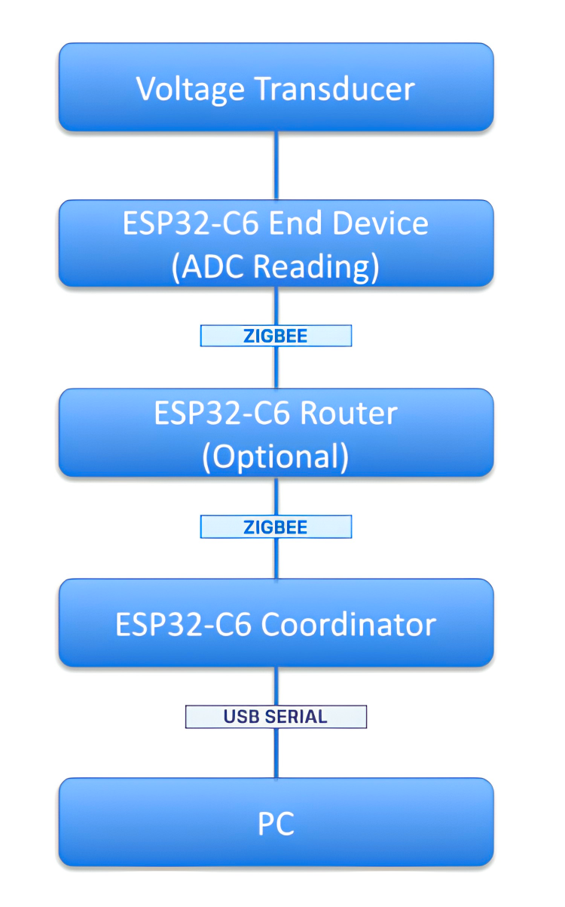

# Zig_Transducer
A Zigbee based WSN Node setup to read Transducer data

### Motivation
If you tried to make a project with zigbee outside the built-in examples from arduino ide or esp ide, you know it is frustratingly cumbersome. I went through it and hence sharing some of my experience, so you don't have to go through same hassle.

---

**This project makes use of ESP32-C6-Devkitc-1-N8 modules as the coordinator, router (if needed) and end device nodes. To flash these boards, I used ESP IDE with ESP IDF version 5.3.2 (For some reason they removed some of the zigbee stack featureset in later versions). I faced many compilation issue while doing this on Windows, so eventually installed Ubuntu 24.04.4 and there downloaded ESP IDF 5.3.2, then this worked. So, if you are facing errors while compiling, the IDF version could be the issue.**

---

### Project Description
1. A voltage transducer reads the real voltage and gives proportional analog voltage that can be safely measured by the ESP32-C6.
2. ESP32-C6 end device processes this ADC reading, converts it into the corresponding voltage value, and sends the data wirelessly over the Zigbee network.
3. The coordinator receives these packets and outputs the received measurements through the serial monitor.
   
---

### Block Diagram
<p align="center">
  
</p>

---

### Repository Structure 
```text
Zig_Transducer/
├── documentations/      # Block diagrams and documentation images
├── src/
│   ├── coordinator/     # Coordinator firmware
│   ├── end_device/      # End Device firmware
│   └── router/          # Router firmware
├── LICENSE
└── README.md
```

---

### Software Requirements
- ESP-IDF v5.3.2
- ESP IDE
- ESP Zigbee SDK
- Python (for esptool.py)

---

### Wiring
#### End Device Side

> **Note**
> The end device uses **GPIO1 (ADC1_CH1)** for reading the analog output of the voltage transducer.

| Voltage Transducer Pin | ESP32-C6 Pin |
|------------------------|--------------|
| VCC                    | 5V |
| GND                    | GND |
| TRANSDUCER OUT +       | GPIO1 (ADC1_CH1) |
| TRANSDUCER OUT -       | GND |

---

### Pre-flashing Instructions
1. Before clicking build, make sure you have chosen the correct board. It is best practice to make sure your com port detects the chip automatically through the inbuilt detect option while you       select the board.
2. After you have used this code, update the `Cmakelists.txt` within the main folder with the name of the .c files you are saving as.
   It should be like this:
  ```cmake
	idf_component_register(
	  SRCS 
		  "Trans_coordinator.c"
      INCLUDE_DIRS 
      	"."
	)
  ```
3. While flashing, before you connect the usb cable to the ESP board, press and hold the boot button, connect the cable then release, makes the board enter boot mode.
4. If you have already tried flashing other zigbee firmwares before and want to start over again, you should erase the chip's old firmware before uploading new, cause even if you change             firmware, the zigbee defined pan id and address remains unchanged. I like to do it by going in `eim > Open Dashboard > Open IDF Terminal (1st Option)` then type `esptool.py --chip YOUR_CHIP -    -  port YOUR_PORT erase_flash`.
   For Windows, the com port would be like `COM5`, for Linux it would be of the format `/dev/ttyUSB0`

---

### Pairing Procedure
1. Flash the coordinator first
2. Flash the router(s) / end device(s) (Don't flash the codes from separate PCs, doing so assigns them separate addresses, hence pairing fails)
3. Turn on the coordinator first, wait a few seconds to let it form the network.
4. Turn on the router(s) / end device(s) next.
5. Check serial monitor to see if the end devices joined the network.

---

### Troubleshooting
| Problem               | Solution                        |
| --------------------- | ------------------------------- |
| Doesn't compile       | Use ESP-IDF 5.3.2               |
| End device won't join | Erase flash                     |
| No serial output      | Check baud rate                 |
| Router not forwarding | Verify it's joined the same PAN |


---

### Future Improvements
The current implementation serves as a basic Zigbee-based wireless voltage monitoring system. Some planned improvements include:

- [ ] Support for multiple end devices transmitting simultaneously.
- [ ] Battery-powered end devices with low-power sleep modes.
- [ ] Periodic sensor reporting with configurable transmission intervals.
- [ ] Automatic network rejoin after power loss or communication failure.
- [ ] Over-the-Air (OTA) firmware update support.
- [ ] Integration with MQTT and cloud platforms through a Zigbee gateway.
- [ ] Real-time data logging and visualization dashboard.
- [ ] Mobile/Web interface for remote monitoring.
- [ ] Support for additional sensors such as current, temperature, humidity, and power measurement modules.
- [ ] LCD/OLED display on the coordinator for standalone operation.
- [ ] Support for encrypted Zigbee communication and enhanced network security.
- [ ] PCB design for a compact and deployable hardware module.

---

### References
- ESP-IDF Documentation
- ESP Zigbee SDK Documentation
- Espressif ESP32-C6 Technical Reference Manual

---

### License

This project is licensed under the MIT License - see the [LICENSE](LICENSE) file for details.
